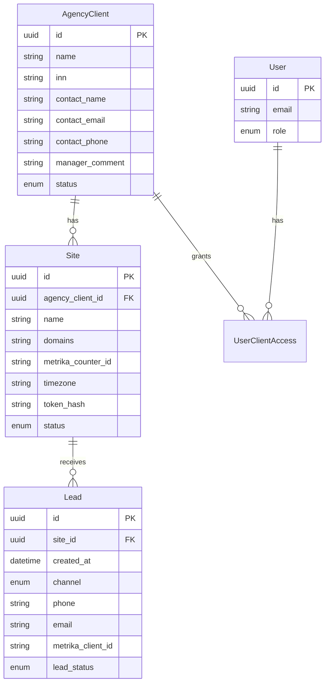
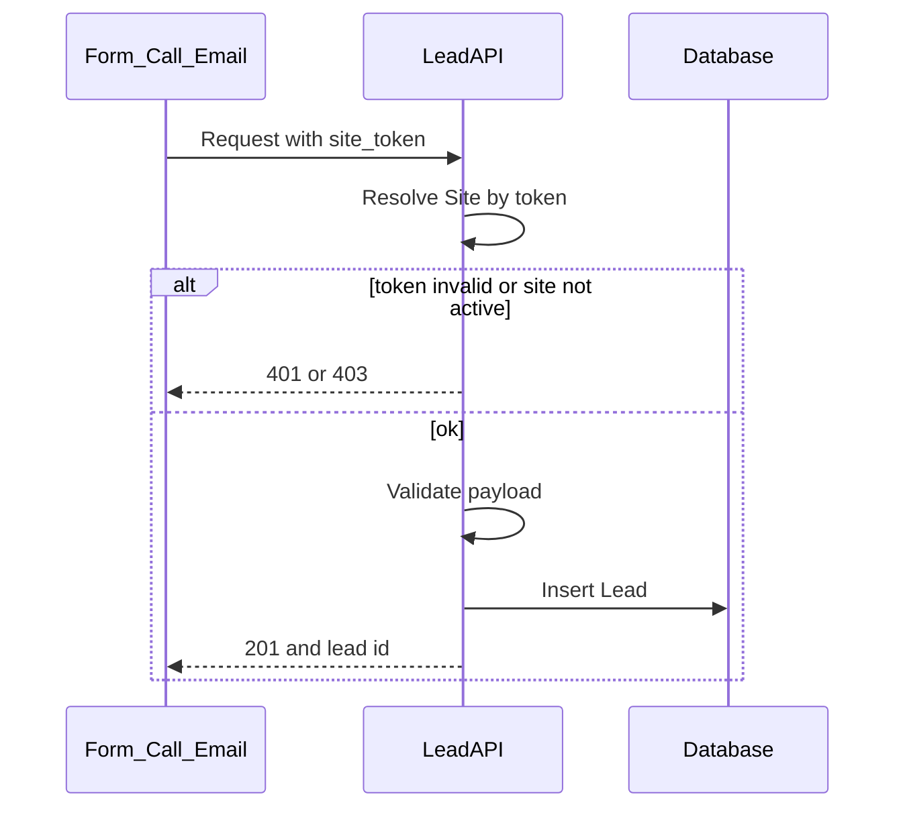

# Техническое задание (архивная копия)

> **Актуальные документы:** [docs/PROEKT.md](docs/PROEKT.md) · [docs/TZ.md](docs/TZ.md) · [docs/etapy/](docs/etapy/)

---

# Техническое задание: платформа учёта лидов и сквозной аналитики (SaaS)

| | |
|---|---|
| **Версия** | 1.0 (черновик для согласования) |
| **Статус** | На согласовании |
| **Аудитория** | Product, разработка, дизайн, заказчик (агентство) |

---

## Краткое резюме (Executive Summary)

Digital-агентство ведёт рекламу для заказчиков и нуждается в **единой системе учёта лидов** с привязкой к рекламным источникам. Продукт — **SaaS** с двумя интерфейсами:

1. **Админ-панель** — сотрудники агентства создают **заказчиков** (клиентов агентства), добавляют им **сайты**, получают **токен** на каждый сайт и настраивают приём лидов.
2. **Личный кабинет заказчика** — конечный клиент видит лиды по своим сайтам без доступа к настройкам и чужим данным.

**Ключевое правило данных:** лид всегда привязан к **сайту**, а не к заказчику напрямую. Сайт определяется по **токену** при приёме заявки (форма, коллтрекинг, почта).

Источники лидов в MVP: **формы сайта**, **коллтрекинг** (например, [Callibri](https://callibri.ru/)), **входящая почта**. Атрибуция — UTM с формы, **Client ID Яндекс Метрики**, при необходимости — обогащение из Метрики в v2.

---

## 1. Введение

### 1.1. Назначение документа

ТЗ описывает функциональные и нефункциональные требования к платформе для разработки MVP и оценки трудозатрат. Документ опирается на текущий процесс агентства и выгрузку полей личного кабинета ([WBooster - личный кабинет клиента.xlsx](WBooster%20-%20%D0%BB%D0%B8%D1%87%D0%BD%D1%8B%D0%B9%20%D0%BA%D0%B0%D0%B1%D0%B8%D0%BD%D0%B5%D1%82%20%D0%BA%D0%BB%D0%B8%D0%B5%D0%BD%D1%82%D0%B0.xlsx)).

### 1.2. Глоссарий

| Термин | Определение |
|--------|-------------|
| **Заказчик** (клиент агентства) | Компания, для которой агентство ведёт рекламу; сущность `AgencyClient` в системе |
| **Сайт** | Конкретный веб-ресурс / домен заказчика; единица приёма лидов; имеет уникальный **токен** |
| **Лид** | Обращение (заявка, звонок, письмо), сохранённое в системе и привязанное к **сайту** |
| **Токен сайта** | Секрет для идентификации сайта при приёме лида через API/webhook/почту |
| **Client ID Метрики** | Идентификатор посетителя в Яндекс Метрике (`getClientID()`), поле `metrika_client_id` |
| **ЛК** | Личный кабинет пользователя со стороны заказчика |
| **Админка** | Панель администратора агентства |
| **ACC / PPC** | Внутренние контуры услуг агентства (не путать с рекламной системой «Яндекс Директ») |

---

## 2. Цели и границы продукта

### 2.1. Цели

- Собирать лиды из **форм**, **коллтрекинга** и **почты** в одном месте.
- Показывать **канал поступления** и **рекламную атрибуцию** (UTM, тип трафика, Client ID Метрики).
- Давать заказчику **прозрачный ЛК** по своим сайтам.
- Давать агентству **админку** для онбординга заказчиков, сайтов и интеграций.
- Заложить архитектуру под **SaaS** (изоляция заказчиков, роли, масштабирование).

### 2.2. MVP v1 (в scope)

| Область | Содержание |
|---------|------------|
| Админка | CRUD заказчика и сайта, токен, реестр лидов, приглашение в ЛК |
| ЛК заказчика | Список/карточка лидов, фильтры, экспорт CSV |
| Приём лидов | API по токену: форма (POST), webhook коллтрекинга, почта (alias на сайт) |
| Поля лида | Справочник по разделу 10 (ядро из Excel) |
| Метрика | Передача `metrika_client_id` с формы; счётчик в карточке сайта |
| UTM | С формы + cookie «первое касание» на сайте |
| Безопасность | Токен не в публичном JS; POST; rate limit |

### 2.3. Вне scope v1 (явно отложено)

- Биллинг, тарифы, self-service регистрация заказчиков
- SSO / SAML, 2FA
- Data-driven атрибуция, сложные модели (time decay и т.д.)
- Обогащение лидов через Reporting API Метрики (batch) — **v2**
- Слияние дублей в одну карточку (в v1 только **пометка** «дубль»)
- Ротация токена с grace-period (можно упростить до «перевыпуск = старый сразу недействителен»)
- Публичный API для BI заказчика
- Интеграция с внешней CRM (двусторонняя синхронизация) — отдельный этап

---

## 3. Роли и сценарии

### 3.1. Роли

| Роль | Интерфейс | Область |
|------|-----------|---------|
| **Администратор платформы** | Админка | Все заказчики, сайты, токены, все лиды |
| **Пользователь ЛК** | ЛК | Лиды заказчика, к которому привязан; фильтр по сайту |
| **Менеджер агентства** (опционально v1) | Админка | Подмножество заказчиков; без управления глобальными настройками платформы |

**Решение по умолчанию:** доступ в ЛК на уровне **заказчика** (все его сайты), с фильтром по сайту в интерфейсе.

### 3.2. User stories

**Администратор**

1. Как администратор, я создаю **заказчика** с названием и контактами, чтобы вести его проекты в одном месте.
2. Как администратор, я добавляю **сайт** заказчику и копирую **токен**, чтобы подключить форму на Tilda.
3. Как администратор, я настраиваю **webhook** коллтрекинга с токеном сайта, чтобы звонки попадали на нужный сайт.
4. Как администратор, я приглашаю **пользователя ЛК** по email, чтобы заказчик видел свои лиды.
5. Как администратор, я меняю **статус лида** и внутренний комментарий, чтобы отражать работу менеджера.

**Пользователь ЛК**

6. Как пользователь ЛК, я выбираю **сайт** и период, чтобы видеть лиды с рекламных кампаний.
7. Как пользователь ЛК, я открываю **карточку лида** с UTM и каналом, чтобы оценить качество трафика.
8. Как пользователь ЛК, я **экспортирую CSV** за период, чтобы передать данные в отчёт.

---

## 4. Модель данных

### 4.1. Иерархия

```
AgencyClient (заказчик)
  └── Site (сайт) [token]
        └── Lead (лид)
User ──привязка──► AgencyClient (для ЛК)
```

Лиды **не** создаются на уровне заказчика без сайта.

### 4.2. ER-диаграмма



### 4.3. Сущность: Заказчик (`AgencyClient`)

| Поле | Тип | Обяз. | Описание |
|------|-----|-------|----------|
| `id` | UUID | да | Первичный ключ |
| `name` | string | да | Название организации |
| `inn` | string | нет | ИНН (B2B) |
| `contact_name` | string | нет | Контактное лицо |
| `contact_email` | string | нет | Email для связи (не лиды) |
| `contact_phone` | string | нет | Телефон для связи |
| `manager_comment` | text | нет | Внутренний комментарий агентства; **не в ЛК** |
| `status` | enum | да | `active` \| `archived` |
| `created_at`, `updated_at` | datetime | да | Аудит |

### 4.4. Сущность: Сайт (`Site`)

| Поле | Тип | Обяз. | Описание |
|------|-----|-------|----------|
| `id` | UUID | да | Первичный ключ |
| `agency_client_id` | UUID | да | FK на заказчика |
| `name` | string | да | Внутреннее название («Ruflex Pro») |
| `domains` | string[] | да | Домены посадочных, напр. `ruflex-pro.ru` |
| `metrika_counter_id` | string | нет | ID счётчика Яндекс Метрики |
| `timezone` | string | да | По умолчанию `Europe/Moscow` |
| `token` | string | да | Секрет приёма лидов; в БД хранить **хэш**; показывать plaintext **один раз** при создании/ротации |
| `status` | enum | да | `active` \| `paused` \| `archived` |
| `email_inbound_address` | string | нет | Alias для почты, напр. `leads+{token_short}@inbound.example.com` |
| `created_at`, `updated_at` | datetime | да | Аудит |

**Правила токена:**

- Генерируется при создании сайта (криптостойкий, ≥ 32 байт энтропии в представлении).
- Один токен = один сайт; запрещено переиспользование между сайтами.
- `paused` / `archived` → приём лидов отклоняется (HTTP 403).

### 4.5. Сущность: Лид (`Lead`)

См. полный справочник в **разделе 10**. Обязательные поля при создании:

| Поле | Обяз. | Описание |
|------|-------|----------|
| `site_id` | да | Из токена |
| `channel` | да | `form` \| `call` \| `email` |
| `created_at` | да | Время поступления (серверное) |
| `phone` или `email` | да* | Хотя бы один контакт (*кроме технических писем — см. почту) |

### 4.6. Сущность: Пользователь (`User`)

| Поле | Тип | Описание |
|------|-----|----------|
| `id` | UUID | |
| `email` | string | Логин |
| `password_hash` | string | Или magic link в v1 |
| `role` | enum | `platform_admin` \| `client_user` |
| `agency_client_id` | UUID | Для `client_user` — привязка к заказчику |

### 4.7. Дедупликация (v1)

При создании лида: если за **30 дней** на том же `site_id` уже есть лид с тем же нормализованным `phone` или `email` → установить флаг `is_duplicate = true`, **не** объединять записи.

---

## 5. Админ-панель

### 5.1. Модуль «Заказчики»

- Список заказчиков: поиск по названию, ИНН, фильтр по статусу.
- Создание / редактирование / архивирование (архив — только чтение новых лидов, история сохраняется).
- Карточка заказчика: поля из п. 4.3, вкладка **«Сайты»**, вкладка **«Пользователи ЛК»**.

### 5.2. Модуль «Сайты»

- Создание сайта внутри заказчика; поля из п. 4.4.
- Отображение и копирование **токена** (кнопка «Показать / перевыпустить»).
- Инструкция по интеграции: URL API, пример webhook, email alias.
- Статусы: активен / приостановлен / архив.

### 5.3. Модуль «Лиды»

- Таблица лидов: фильтры по заказчику, сайту, периоду, каналу, статусу, UTM source, дублю.
- Карточка лида: **все поля** из раздела 10, включая ACC/PPC и комментарии менеджера.
- Редактирование: статус лида, менеджер, комментарий, поля сделки (ИНН, сумма и т.д.) — поля с источником «ручной ввод админа».

### 5.4. Модуль «Пользователи ЛК»

- Приглашение по email, привязка к `agency_client_id`.
- Деактивация доступа.

### 5.5. Журнал (желательно v1)

- Лог: создание/изменение заказчика, сайта, ротация токена, смена статуса лида (кто, когда).

---

## 6. Личный кабинет заказчика

### 6.1. Функции MVP

- Авторизация (email + пароль или magic link).
- Дашборд-заглушка или сразу список лидов (сводные KPI — **v2**).
- Список лидов с пагинацией.
- Фильтры: период, **сайт**, канал, статус (публичные), UTM campaign.
- Карточка лида (поля с видимостью «ЛК» из раздела 10).
- Экспорт CSV (те же фильтры, только видимые колонки).

### 6.2. Ограничения

- Нет CRUD заказчиков и сайтов.
- Нет отображения и копирования **токенов**.
- Нет внутренних полей агентства (ACC/PPC детали, комментарий менеджера, IP) — unless explicitly marked visible.

### 6.3. Матрица видимости полей

См. колонку **«ЛК»** в разделе 10.

---

## 7. Приём лидов (каналы)

Общий pipeline:



### 7.1. Формы на сайте (Tilda и др.)

**Требование:** токен **не** в публичном JavaScript.

**Рекомендуемая схема:**

1. Браузер отправляет данные формы на **прокси** (serverless / backend заказчика) без токена в коде страницы.
2. Прокси добавляет `token` и вызывает `POST /api/v1/leads`.
3. Альтернатива для MVP: публичный endpoint с токеном только если домен проверяется по `Referer` / allowlist — **менее безопасно**, не рекомендуется как основной вариант.

**Данные с формы:** телефон, email, имя, `description` (текст кнопки/формы), `page_url`, UTM из hidden fields или cookie, `metrika_client_id` из `yaCounter.getClientID()`.

**Ответ:** `{ "id": "<lead_uuid>" }` — для обратной записи в Метрику (`yaCounter.params({ wbooster: id })`).

### 7.2. Коллтрекинг (Callibri)

- В админке для сайта: URL webhook вида `https://{host}/api/v1/leads/call?token={site_token}` или заголовок `X-Site-Token`.
- Платформа принимает POST от Callibri, маппит поля по таблице:

| Поле Callibri (пример) | Поле Lead | Примечание |
|------------------------|-----------|------------|
| Номер звонящего | `phone` | |
| Время звонка | `created_at` | Если передано провайдером |
| Кампания / источник | `utm_campaign`, `utm_source` | По документации провайдера |
| Запись разговора | `call_recording_url` | URL, опционально |
| Длительность | `call_duration_sec` | опционально |

- `channel` = `call`.
- Если UTM/Client ID недоступны → `advertising_channel` = «Нет данных» (см. раздел 9).

### 7.3. Входящая почта

**Решение для MVP:** уникальный **inbound-адрес на сайт**:

- Формат: `leads+{site_id_or_token_short}@inbound.{domain}` или отдельный alias на домене агентства.
- Письмо парсится: `From`, `Subject`, `Date`, тело (text/html).
- `channel` = `email`; контакт из `From` или парсинг тела (regex телефон/email).
- UTM и Client ID обычно **пустые** — ожидаемое поведение.

---

## 8. API приёма лидов

**Спецификация OpenAPI 3.1:** [openapi.yaml](./openapi.yaml) — endpoint, схемы, примеры и коды ответов для генерации клиентов и тестов.

### 8.1. `POST /api/v1/leads`

**Аутентификация:** токен сайта — в теле JSON, query (только для webhook-провайдеров) или заголовке `X-Site-Token`.

**Request (JSON):**

```json
{
  "token": "site_secret_token",
  "channel": "form",
  "phone": "+79001234567",
  "email": "",
  "name": "Иван",
  "description": "Связаться с нами в футере",
  "page_url": "https://ruflex-pro.ru/page",
  "metrika_client_id": "17791064241773632",
  "utm_source": "yandex-tovarnaya",
  "utm_medium": "cpc",
  "utm_campaign": "cid|707701012|search",
  "utm_term": "---autotargeting",
  "utm_content": "gid|5723995001|...",
  "utm_campaign_first": "cid",
  "ip": "128.204.75.100"
}
```

| Поле | Обяз. | Описание |
|------|-------|----------|
| `token` | да | Токен сайта |
| `channel` | да | `form` \| `call` \| `email` |
| `phone` / `email` | да* | Хотя бы одно |
| Остальные | нет | См. справочник |

**Responses:**

| Код | Условие |
|-----|---------|
| `201` | Лид создан; тело `{ "id": "uuid" }` |
| `401` | Неверный токен |
| `403` | Сайт приостановлен или в архиве |
| `422` | Ошибка валидации (нет контакта, неверный channel) |
| `429` | Rate limit |

### 8.2. Rate limiting

- Не более **60 запросов/мин** на токен (настраиваемо).
- При превышении — `429`, логирование для админа.

### 8.3. Webhook звонков

`POST /api/v1/leads/call` — тело по формату провайдера + обязательный `token` (query или header). Внутри — нормализация в общую модель `Lead`.

---

## 9. Яндекс Метрика

### 9.1. На стороне сайта

- В карточке сайта хранится `metrika_counter_id`.
- При отправке формы передавать `metrika_client_id` строкой (без потери точности в JSON/БД).
- После создания лида — опционально `yaCounter.params({ wbooster: <lead_id> })`.

### 9.2. Рекламный канал (`advertising_channel`)

| Условие | Значение |
|---------|----------|
| Есть UTM с `utm_medium=cpc` или source содержит `yandex` / `google` | «Переходы по рекламе» |
| Иначе, Client ID есть, но UTM пустые | «Нет данных» (до обогащения v2) |
| Почта / звонок без склейки | «Нет данных» |

### 9.3. UTM Campaign (первая секция)

- **v1:** cookie на сайте (`utm_campaign_first`), передаётся в API вместе с формой; окно хранения cookie — **90 дней**.
- **v2:** дообогащение через API Метрики по `metrika_client_id`.

### 9.4. Валидация домена

При приёме лида: если передан `page_url`, домен должен входить в `site.domains` (предупреждение в логе или мягкая валидация — на усмотрение разработки; в ТЗ рекомендуется **warning**, не блокировка).

---

## 10. Справочник полей лида

Основан на выгрузке WBooster. Колонки: **источник данных**, **видимость в ЛК**.

| Поле (UI) | Код поля | Источник | ЛК | Примечание |
|-----------|----------|----------|-----|------------|
| Дата | `created_at` | авто | да | Время поступления |
| Телефон или Email | `phone`, `email` | форма / звонок / почта | да | Хотя бы одно |
| Источник | `channel` | авто | да | Заявка / Звонок / Заявка на почту |
| Рекламный канал | `advertising_channel` | правило (разд. 9) | да | Переходы по рекламе / Нет данных |
| Описание формы | `form_description` | форма | да | Текст CTA |
| Статус лида | `lead_status` | админ / CRM | да | Enum, разд. 11 |
| Менеджер | `manager_name` | админ | нет* | *Опционально показывать только имя в ЛК |
| ФИО | `contact_name` | форма | да | IP — см. ниже |
| ИНН | `inn` | админ | нет | B2B |
| Город | `city` | форма / админ | да | |
| Запрос на продукт | `product_request` | форма / админ | да | |
| Кол-во SKU | `sku_count` | форма / админ | да | |
| Комментарий | `manager_comment` | админ | нет | Внутренний |
| Ожидаемая сумма | `expected_amount` | админ | нет | Без НДС |
| Домен посадочной | `landing_domain` | форма / сайт | да | Сверка с `site.domains` |
| UTM Source … Content | `utm_*` | форма / коллтрекинг | да | |
| UTM Campaign (первая секция) | `utm_campaign_first` | cookie / v2 Метрика | да | |
| ID | `id` | авто | да | UUID лида |
| CLIENT ID | `metrika_client_id` | форма | да | Строка |
| Статус лида ACC | `acc_status` | админ | нет | Внутренний контур |
| Комментарий ACC | `acc_comment` | админ | нет | |
| Статус лида PPC | `ppc_status` | админ | нет | Внутренний контур |
| Комментарий PPC | `ppc_comment` | админ | нет | |
| Статус ACC+PPC | `acc_ppc_summary` | вычисляемое | нет | Напр. «да»/«нет» |
| IP посетителя | `visitor_ip` | форма | **нет** | Не показывать в ЛК; не дописывать в ФИО |
| Дубль | `is_duplicate` | авто | нет | Флаг, разд. 4.7 |
| Запись звонка | `call_recording_url` | коллтрекинг | да | Если есть |

---

## 11. Статусы и workflow

### 11.1. Статусы лида (`lead_status`)

Значения из текущей практики (Excel):

| Значение | Описание |
|----------|----------|
| `not_processed` | Лид не обработан |
| `no_answer` | Не ответили на звонок |
| `preparing_offer` | Составляем КП |
| `not_interested` | Клиент неинтересен |
| `deal_lost` | Сделка провалена |

Переходы: свободные в админке; в ЛК — **только просмотр**.

Начальный статус при создании: `not_processed`.

### 11.2. Контуры ACC и PPC

Внутренние направления работы агентства над лидом (не путать с рекламными кабинетами).

| Контур | Кто заполняет | ЛК |
|--------|---------------|-----|
| ACC | Менеджер агентства в админке | Скрыто |
| PPC | Менеджер агентства в админке | Скрыто |
| ACC+PPC (сводный) | Вычисляется или вручную | Скрыто |

Расшифровку статусов ACC/PPC зафиксировать в операционном регламенте агентства (вне кода).

---

## 12. Безопасность и персональные данные

- Обработка ПДн (телефон, email, ФИО) — в соответствии с 152-ФЗ; политика конфиденциальности на стороне агентства/платформы.
- Токен сайта: хранение в БД как **хэш** (bcrypt/argon2); plaintext показывать один раз при создании/ротации.
- HTTPS для всех endpoint.
- Запрет передачи ПДн в URL (GET).
- Аудит действий администратора (желательно v1).
- Изоляция: пользователь ЛК не может запросить лиды чужого `agency_client_id` (проверка на API).
- Маскирование в ЛК (опционально v2): частичное скрытие телефона в списке.

---

## 13. Нефункциональные требования

| Параметр | Требование MVP |
|----------|----------------|
| Задержка появления лида в UI | ≤ 5 сек после успешного API |
| Доступность API приёма | 99.5% / месяц (целевое) |
| Хранение лидов | Не менее 24 месяцев (настраиваемо) |
| Одновременные пользователи | 50+ в админке и ЛК без деградации (уточнить нагрузочным тестом) |
| Язык UI | Русский |

---

## 14. Критерии приёмки MVP

1. Администратор создаёт заказчика с обязательным полем «название».
2. Администратор добавляет сайт заказчику, получает токен, сайт в статусе «активен».
3. `POST /api/v1/leads` с валидным токеном создаёт лид; ответ содержит `id`.
4. Запрос с неверным токеном → `401`.
5. Запрос к архивному сайту → `403`.
6. Лид отображается в админке с каналом `form` и переданными UTM.
7. Пользователь ЛК видит этот лид; пользователь другого заказчика — **не видит**.
8. Фильтр по сайту в ЛК работает корректно.
9. Экспорт CSV содержит только поля, разрешённые для ЛК.
10. Webhook коллтрекинга (тестовый payload) создаёт лид с `channel=call`.
11. Входящее письмо на alias сайта создаёт лид с `channel=email`.
12. Дубль по телефону на том же сайте за 30 дней помечается `is_duplicate=true`.
13. `metrika_client_id` сохраняется строкой без искажения.
14. Токен отсутствует в исходном коде публичной страницы Tilda (проверка приёмочного сценария).
15. Поля ACC/PPC не отображаются в ЛК.

---

## 15. Открытые вопросы

| # | Вопрос | Решение по умолчанию в ТЗ |
|---|--------|---------------------------|
| 1 | Обогащение UTM из API Метрики | Отложено на **v2** |
| 2 | Показывать ли имя менеджера в ЛК | **Нет** в v1 |
| 3 | Ротация токена | Перевыпуск с немедленной инвалидацией старого |
| 4 | Точный формат webhook Callibri | Уточнить по документации Callibri при разработке; таблица маппинга в п. 7.2 |
| 5 | Роль «менеджер агентства» | Опционально; не блокирует MVP |

---

## Приложение A. Текущая интеграция (legacy)

### A.1. Как работает сейчас

Формы на Tilda отправляют заявку **напрямую из браузера** на `crm.wbooster.ru` методом **GET** с параметрами в query string, включая **токен** в открытом виде.

Пример паттерна (упрощённо):

```javascript
$.get("https://crm.wbooster.ru/index.php", {
  token: '----:72bbfb11d7131b3fcda1253b7123ffe9',
  metrika_client_id: yaCounter ? yaCounter.getClientID() : null,
  name: 'NoName',
  phone: $("input.t447__input", form).val(),
  description: "Связаться с нами в фоотер"
});
```

### A.2. Риски

| Риск | Описание |
|------|----------|
| Утечка токена | Токен в JS — любой может слать лиды |
| Утечка ПДн | Телефон в URL попадает в логи |
| Нет привязки к сайту | Токен должен однозначно указывать на **сайт**, не на «общую» CRM |
| NoName | Пустое имя ухудшает качество данных |

### A.3. План миграции

1. Создать заказчика и **сайт** в новой админке; получить новый токен.
2. Развернуть `POST /api/v1/leads` и прокси без токена на фронте.
3. Переключить формы по одному сайту; проверить лиды и Метрику.
4. Отозвать старые токены на `crm.wbooster.ru` после cutover.

---

*При изменении бизнес-правил обновляйте разделы 2, 4, 10–11 и критерии приёмки (раздел 14).*
