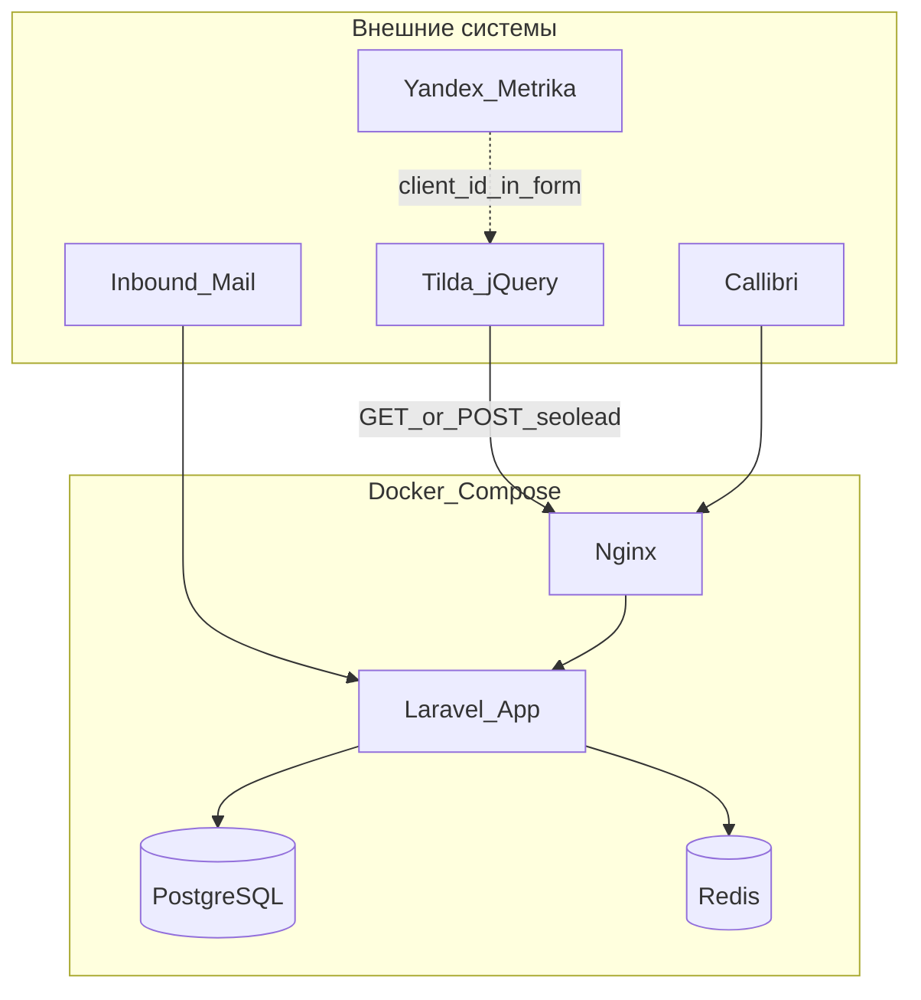

# WBooster CRM — проект: ТЗ, стек, решения

| | |
|---|---|
| **Версия** | 1.0 |
| **Окружение (старт)** | `localhost` (Docker Compose) |
| **Деплой (тест)** | Coolify |
| **Обратная совместимость** | со старым `crm.wbooster.ru` — **не требуется** |

Полное ТЗ: [TZ.md](./TZ.md) · API: [../openapi.yaml](../openapi.yaml) · Этапы: [etapy/README.md](./etapy/README.md)

---

## 1. Суть продукта

SaaS-платформа для digital-агентства:

- **Админка** — заказчики (клиенты агентства), их **сайты**, токены, все лиды.
- **ЛК заказчика** — просмотр лидов по своим сайтам.
- **Приём лидов** с форм (простой JS на Tilda), коллтрекинга, почты.

**Иерархия данных:**

```
Заказчик (AgencyClient)
  └── Сайт (Site) — уникальный token
        └── Лид (Lead)
```

Лид **всегда** привязан к **сайту**, определяется по **токену** в запросе.

---

## 2. Принятые решения (от заказчика разработки)

| Вопрос | Решение |
|--------|---------|
| Стек | Laravel 11 + PostgreSQL + Redis + Docker |
| Dev URL | `http://localhost` (порты в compose) |
| Prod URL | `https://crm.mv-deploy.ru` (Coolify) |
| Scope первой волны | **Всё из MVP ТЗ** (админка, ingestion, ЛК, интеграции) |
| Тестовые данные | см. раздел 8 |
| Legacy API wbooster.ru | **Не поддерживать** |
| Формы на сайте | Публичный endpoint в стиле `seolead` + jQuery; GET и POST; токен в запросе (простота Tilda) |
| Масштабирование | Модульный монолит; интеграции через слой `Integrations` |

---

## 3. Технический стек

### 3.1. Backend

| Компонент | Технология |
|-----------|------------|
| Framework | **Laravel 11** (PHP 8.3+) |
| БД | **PostgreSQL 16** |
| Кэш / очереди | **Redis 7** |
| ORM | Eloquent |
| Админка | **TailAdmin Vue** (SPA) + Laravel JSON API (`/api/admin`) |
| API лидов | Laravel routes, отдельный middleware `AuthenticateSiteToken` |
| Очереди | Laravel Horizon (опционально на этапе 7) |

### 3.2. Frontend

| Область | Технология |
|---------|------------|
| Админка | Vue 3 + Vite + TailAdmin ([`frontend/`](../frontend/)) |
| ЛК заказчика | TailAdmin Vue (отдельная панель, этап 5) |
| Сниппет на сайте клиента | jQuery / vanilla — **вне** репозитория (документация в `docs/snippets/`) |

### 3.3. Инфраструктура

| Среда | Схема |
|-------|--------|
| Локально | `docker-compose.yml`: `app`, `nginx`, `postgres`, `redis` |
| Coolify | Build из `Dockerfile`, env из UI, тот же образ |
| Прод (позже) | Контейнеры через Coolify; отказ от Docker на bare metal не планируется |

### 3.4. Модули приложения (namespace)

```
app/
  Models/           AgencyClient, Site, Lead, User
  Http/
    Controllers/
      Ingest/       SeoLeadController
      Integrations/ CallibriWebhookController
  Filament/
    Admin/          панель агентства
    Client/         ЛК заказчика
  Services/
    LeadIngestionService.php
    AdvertisingChannelResolver.php
    DuplicateLeadDetector.php
  Integrations/
    Callibri/
    InboundMail/
    YandexMetrika/  (v2)
```

### 3.5. Сторонние сервисы

| Сервис | Назначение | Этап |
|--------|------------|------|
| Яндекс Метрика | `metrika_client_id` с формы; счётчик в карточке сайта | 4, v2 API |
| Callibri | Webhook звонков | 6 |
| Inbound email | Парсинг заявок с почты | 6 |
| Sentry (опц.) | Ошибки | 7 |

---

## 4. Архитектура



---

## 5. Приём заявок с сайта (формы)

### 5.1. Endpoint (новый проект)

```
GET|POST  /ingest/seolead
```

Параметры (query или form body):

| Параметр | Обяз. | Описание |
|----------|-------|----------|
| `token` | да | `SITE_ID:secret` из админки |
| `phone` / `email` | да* | Хотя бы одно |
| `name` | нет | |
| `description` | нет | Текст формы |
| `metrika_client_id` | нет | Строка из `getClientID()` |
| `page_url` | нет | |
| `utm_*` | нет | |

**Ответ:** JSON `{ "id": "uuid" }` или plain text `uuid` (для простого `.done(function(id))`).

### 5.2. Сниппет для Tilda (целевой)

```javascript
$(document).ready(function () {
  var yaCounterNumber = 57691633; // из карточки сайта в админке
  var yaCounter = window['yaCounter' + yaCounterNumber] || null;

  $("#form184772240 .t447__submit").on('click', function () {
    var form = $(this).closest('form#form184772240');
    $.post("http://localhost/ingest/seolead", {
      token: 'SITE_UUID:secret_from_admin',
      metrika_client_id: yaCounter ? yaCounter.getClientID() : null,
      name: '',
      phone: $("input.t447__input", form).val(),
      email: '',
      description: 'Связаться с нами в футере',
      page_url: window.location.href
    }).done(function (res) {
      var id = res.id || res;
      if (yaCounter && id) yaCounter.params({ 'crm-lead': id });
    });
  });
});
```

Документация сниппетов: `docs/snippets/tilda-seolead.md` (создать на этапе 4).

### 5.3. Безопасность (компромисс MVP)

- Токен в JS допускается; rate limit 60 req/min на токен + по IP.
- Рекомендация новым клиентам: POST вместо GET.
- Токен в БД — только хэш; формат отображения `id:plaintext` один раз при создании.

---

## 6. Репозиторий

```
crm/
  app/                    # Laravel (создать на этапе 1)
  docker/                 # nginx.conf, php.ini
  docs/
    PROEKT.md             # этот файл
    TZ.md                 # полное ТЗ
    etapy/                # этапы разработки
    snippets/             # примеры для клиентов
  openapi.yaml
  docker-compose.yml
  Dockerfile
  .env.example
  README.md
```

---

## 7. Роли

| Роль | Доступ |
|------|--------|
| `platform_admin` | Filament Admin: всё |
| `client_user` | Filament Client: лиды своего `agency_client_id` |

---

## 8. Тестовые данные (seed)

| Сущность | Значение |
|----------|----------|
| Заказчик | **ООО «Демо Кровля»** |
| ИНН | `7700000000` |
| Контакт | Игорь Савин, `demo@example.com` |
| Сайт 1 | **Ruflex Pro** · `ruflex-pro.ru` · Metrika `57691633` |
| Сайт 2 | **Тест LP** · `test-lp.local` (для localhost) |

После `php artisan db:seed` в админке отображается токен для копирования в сниппет.

---

## 9. Этапы разработки

Выполнять **по порядку**. Каждый этап — отдельный файл с чеклистом.

| № | Файл | Содержание |
|---|------|------------|
| 1 | [ETAP-01-infrastruktura.md](./etapy/ETAP-01-infrastruktura.md) | Docker, Laravel, health |
| 2 | [ETAP-02-model-dannyh.md](./etapy/ETAP-02-model-dannyh.md) | Миграции, модели, seed |
| 3 | [ETAP-03-admin-panel.md](./etapy/ETAP-03-admin-panel.md) | Filament: заказчик, сайт, токен |
| 4 | [ETAP-04-priem-lidov.md](./etapy/ETAP-04-priem-lidov.md) | `/ingest/seolead`, дедупликация |
| 5 | [ETAP-05-lichniy-kabinet.md](./etapy/ETAP-05-lichniy-kabinet.md) | ЛК заказчика |
| 6 | [ETAP-06-integracii.md](./etapy/ETAP-06-integracii.md) | Callibri, почта |
| 7 | [ETAP-07-kachestvo-i-deploy.md](./etapy/ETAP-07-kachestvo-i-deploy.md) | Тесты, Coolify, NFR |

---

## 10. Критерии готовности MVP (сводно)

- [x] Заказчик и 2 сайта в админке, токен копируется
- [x] POST/GET `/ingest/seolead` создаёт лид на правильном сайте
- [x] ЛК показывает только лиды своего заказчика
- [x] Callibri webhook создаёт лид `channel=call`
- [x] Inbound mail создаёт лид `channel=email`
- [x] Экспорт CSV из ЛК
- [x] Docker `compose up` поднимает всё локально

Детали — [TZ.md](./TZ.md) §14, чеклист [MVP-CHECKLIST.md](./MVP-CHECKLIST.md).

---

## 11. Связанные документы

- [TZ.md](./TZ.md) — функциональное ТЗ
- [../openapi.yaml](../openapi.yaml) — REST API (расширенный контракт)
- [../TZ-skvoznaya-analitika-i-edinyiy-potok-lidov.md](../TZ-skvoznaya-analitika-i-edinyiy-potok-lidov.md) — архивная версия ТЗ (можно не обновлять)

---

*При смене стека или решений обновляйте этот файл и соответствующий этап.*
